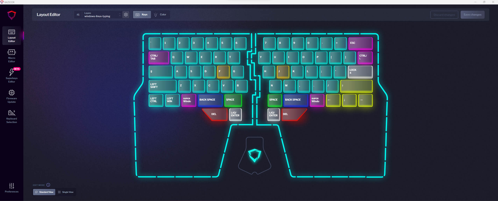
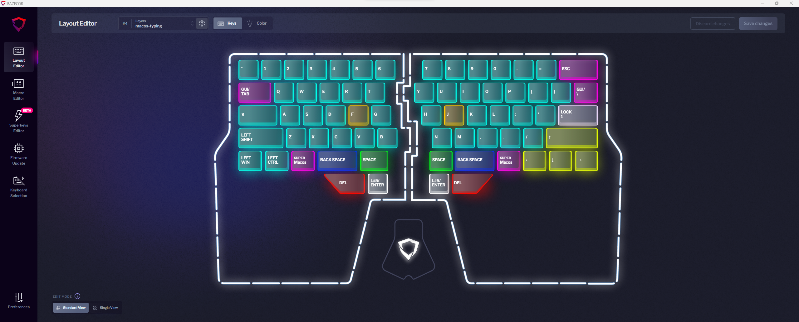
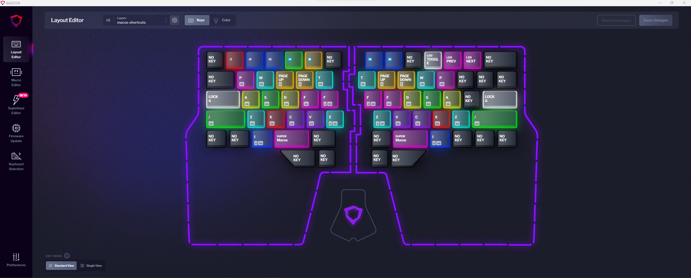
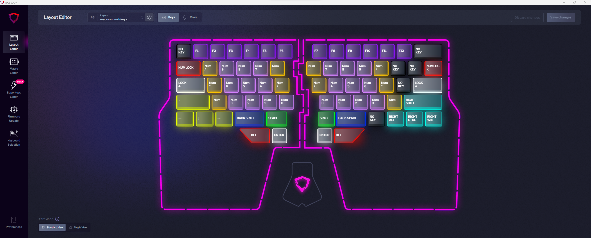

# dygma-raise-layers

My personal dygma raise layer setup with a focus on ambidextrous programming shortcuts and light terminal work.

## Layers

[Windows/Linux Typing](configs/windows-linux-typing.json) and [Macos Typing](configs/macos-typing.json)

- `Escape` replaces `Backspace` via top-right corner
- `Tab` and `\|` keys have dual-function `Ctrl` `Modifier` keys (ambidextrous)
- `Layer` Windows/Linux / Macos keyboard swap button replaces `Enter` key
- Right-side `Alt` and left-side `Function` keys are dual function `Home`/`End` superkeys (ambidextrous)
- `Arrow` keys replace right-side `Modifier` keys
- Thumb clusters have `Space`, `Backspace`, `Delete`, and `Enter` keys (ambidextrous)
- `Enter` thumb cluster keys are dual function `Layer` Shortcut keys (ambidextrous)

[Windows/Linux Shortcuts](configs/windows-linux-shortcuts.json) and [Macos Shortcuts](configs/macos-shortcuts.json)

- number row - media shortcuts
- upper row - Chrome/browser shortcuts (ambidextrous)
- middle row - VSCode/IDE shortcuts (ambidextrous)
- middle row `Layer` keys enter into Num and F keys (ambidextrous)
- lower row - Chrome/browser shortcuts (ambidextrous)

[Windows/Linux Shortcuts](configs/windows-linux-num-f-keys.json) and [Macos Shortcuts](configs/macos-num-f-keys.json)

- number row - `Function` keys
- left-side typing area - `Numpad` keys
- right-side typing area - `Numpad` keys - optimal for right-side (`Numpad` keys on right, `Arrow` keys on left)
- left side - `Arrow` keys
- right side - `Modifier` keys

## License

MIT
