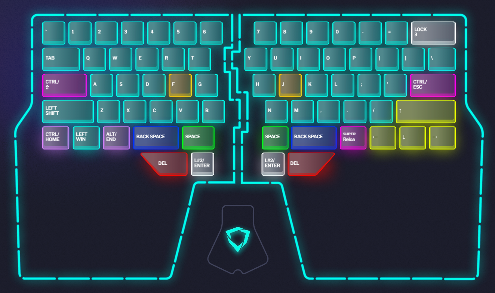
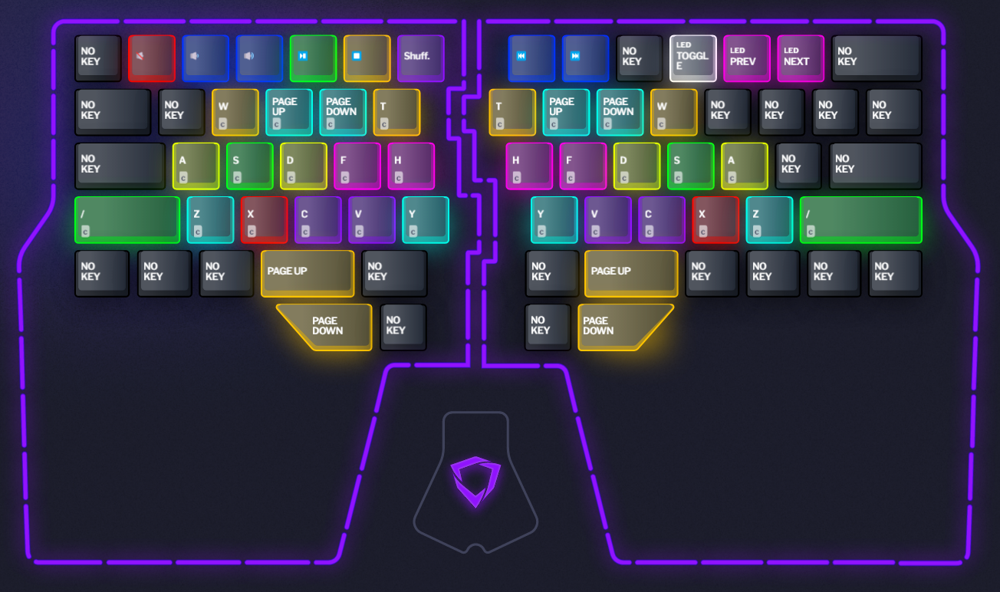
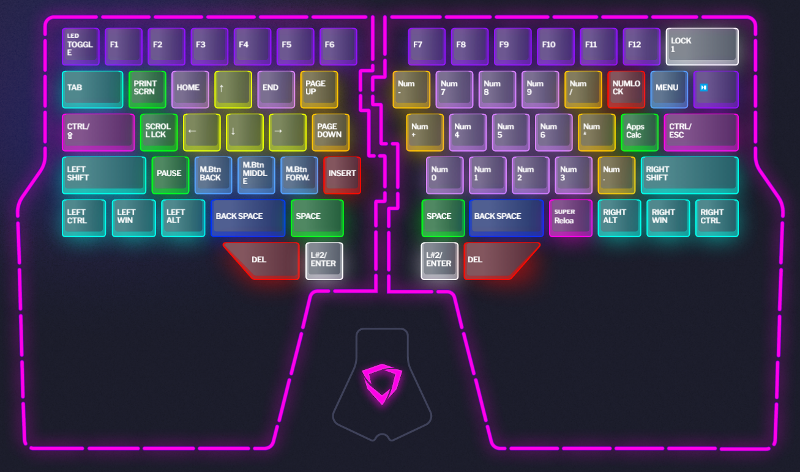

# dygma-raise-layers

My personal dygma raise layer setup with a focus on ambidextrous programming shortcuts and light terminal work.

## Layers

[Layer 0](layer-0.json) — Windows Typing

- caps and escape keys have dual function ctrl modifiers
- left-side modifiers have dual-function home/end keys
- arrow keys replace right-side modifiers
- thumb clusters have space, backspace, delete, and enter/layer (ambidextrous)

[Layer 1](layer-1.json) — Shortcuts

- number row - media shortcuts
- upper row - Chrome/browser shortcuts (ambidextrous)
- middle rows - VSCode/IDE shortcuts (ambidextrous)
- lower rows - page up/page down (ambidextrous)

[Layer 2](layer-2.json) — Everything Else

- number row - Function keys
- left side - Utility keys
- right side - Number pad keys

## License

MIT
